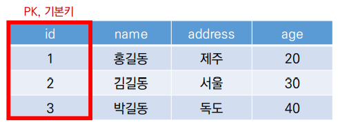

# DB

### Database

데이터베이스는 **체계화된 데이터**의 모임이다. 여러 사람이 공유하고 사용할 목적으로 통합 관리되는 정보의 집합이다. 논리적으로 연관된 (하나 이상의) 자료의 모음으로 그 내용을 고도로 구조화 검색과 생신의 효율화를 꾀한 것이다. 즉, **몇 개의 자료 파일을 조직적으로 통합**하여 **자료 항목의 중복을 없애고 자료를 구조화하여 기억**시켜 놓은 **자료의 잡합체**

#### 데이터베이스로 얻는 장점들

* 데이터 중복 최소화
* 데이터 무결성 (정확한 정보를 저장)
* 데이터 일관성
* 데이터 독립성 (물리적 / 논리적)
* 데이터 표준화
* 데이터 보안 유지

### RDB

* Relational Database
* 키와 값들의 간단한 관계를 표 형태로 정리한 데이터베이스
* 관계형 모델에 기반

**관계형 데이터베이스 용어 정리**

* 스키마 (schema) : 데이터베이스에서 자료의 구조, 표현방법, 관계등 전반적인 **명세를 기술**한 것
* 테이블 : 열(컬럼/필드)과 행(레코드/값)의 모델을 사용해 조직된 데이터 요소들의 집합

* 열 (Column) : 각 열에는 고유한 데이터 형식이 지정됨

* 행 (row) : 실제 데이터가 저장되는 형태

* 기본키 (Primary Key) : 각 행(레코드)의 고유 값
* 반드시 설정해야 하며, 데이터베이스 관리 및 관계 설정 시 주요하게 활용 됨

### RDBMS

* Relational Database Management System
* 관계형 모델을 기반으로 하는 데이터베이스 관리시스템을 의미
  * MySQL
  * SQLite
  * ORACLE
  * MS SQL

SQLite 를 주로 공부함