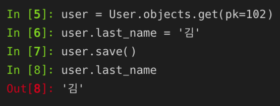
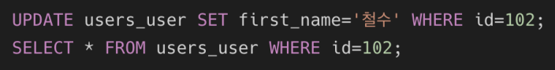
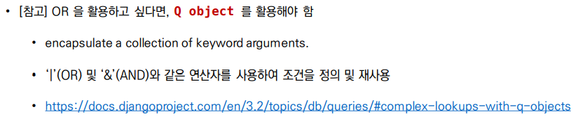
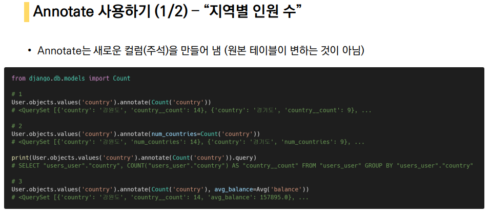
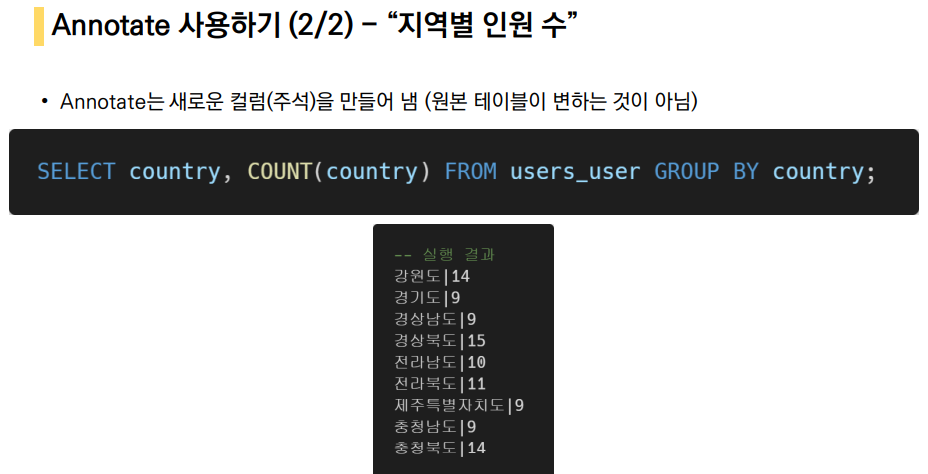

# SQL & ORM

### Django Project Setting

1. 다운로드한 django 프로젝트에서 가상 환경 적용하기
2. requirements.txt 파일로 실습 환경 구성하기

```python
$ pip install -r requirements.txt
```

3. migrate 진행하기

```python
$ python manage.py migrate
$ python manage.py sqlmigrate users 0001
```

4. db.sqlite3 실행하기

```python
$ sqlite3 db.sqlite3
```

#### sqlite 확인 및 .headers on 설정


#### csv 파일을 데이터 베이스에 적용하기


#### 스키마 확인


#### .headers on


#### shell 정리 및 종료

* in sqlite
  * shell clear
  * .exit
* in django_shell_plus
  * clear
  * exit

### CRUD

### READ

#### 모든 user 레코드 조회 - ORM

```shell
User.objects.all()
```

#### 모든 user 레코드 조회 - SQL

```sqlite
SELECT * FROM users_user;
```

### CREATE

#### user 레코드 생성 - ORM

```
User.objects.create (
	first_name='길동',
	last_name='홍',
	age=100,
	country='제주도',
	phone='010-1234-5678',
	balance=10000
)
```

#### 방금 생성한 레코드 확인하기 - SQL

```sql
SELECT * FROM users_user LIMIT 1 OFFSET 100;
```

#### user 레코드 생성 및 확인 - SQL

```sql
INSERT INTO users_user VALUES (102, '길동', '김', 100, '경상북도', '010-1234-1234', 100);
SELECT * FROM users_user LIMIT 2 OFFSET 100;
```

#### user 레코드 생성 실패 예시 1 - SQL


#### user 레코드 생성 실패 예시 2 - SQL


#### user 레코드 생성 실패 예시 3 - SQL


### READ

#### 특정 user 레코드 조회 - ORM

```shell
User.objects.get(pk=102)
```

#### 특정 user 레코드 조회 - SQL

```sql
SELECT * FROM users_user WHERE id=102;
```

### UPDATE

#### 특정 user 레코드 수정 - ORM



#### 특정 user 레코드 수정 및 확인 - SQL



### DELETE

#### 특정 user 레코드 삭제 - ORM

```shell
User.objects.get(pk=102).delete()
```

#### 특정 user 레코드 삭제 - SQL

```sql
DELETE FROM users_user WHERE id=101;
SELECT * FROM users_user WHERE id=101;
```

### SQL & ORM 활용하기

#### 전체 유저의 수를 조회 - ORM

```shell
User.objects.count()
```

#### 전체 유저의 수를 조회 - SQL

```sql
SELECT COUNT(*) FROM users_user;
```

#### 나이가 30살인 사람들의 이름 - ORM

```shell
User.objects.filter(age=30).values('first_name')
```

#### 나이가 30살인 사람들의 이름 - SQL

```sql
SELECT first_name FROM users_user WHERE age=30;
```

#### 대/소 관계 비교 조건

**__gte, \_\_gt, \_\_lte, \_\_lt**

#### 나이가 30살 이상인 사람의 인원 수 - ORM

```shell
User.objects.filter(age__gte=30).count()
```

#### 나이가 30살 이상인 사람의 인원 수 - SQL

```sql
SELECT COUNT(*) FROM users_user WHERE age>=30;
```

#### 나이가 20살 이하인 사람의 인원 수 - ORM

```shell
User.objects.filter(age__lte=20).count()
```

#### 나이가 20살 이하인 사람의 인원 수 - SQL

```sql
SELECT COUNT(*) FROM users_user WHERE age<=20;
```

#### 나이가 30살이면서 성이 김씨인 사람의 인원 수 - ORM

```shell
User.objects.filter(age=30, last_name='김').count()
User.objects.filter(age=30).filter(last_name='김').count()
```

#### 나이가 30살이면서 성이 김씨인 사람의 인원 수 - SQL

```sql
SELECT COUNT(*) FROM users_user WHERE age=30 AND last_name='김';
```

#### 나이가 30살이거나 성이 김씨인 사람의 인원 수 - ORM

```shell
from django.db.models import Q
User.objects.filter(Q(age=30) | Q(last_name='김'))
```



#### 나이가 30살이거나 성이 김씨인 사람의 인원 수 - SQL

```sql
SELECT * FROM users_user WHERE age=30 OR last_name='김';
```

#### 지역번호가 02인 사람의 인원 수 - ORM

```shell
User.objects.filter(phone__startswith='02-').count()
```

#### 지역번호가 02인 사람의 인원 수 - SQL

```sql
SELECT COUNT(*) FROM users_user WHERE phone LIKE '02-%';
```

#### 주소가 강원도이면서 성이 황씨인 사람의 이름 - ORM

```shell
User.objects.filter(country='강원도', last_name='황').values('first_name')
```

#### 주소가 강원도이면서 성이 황씨인 사람의 이름 - SQL

```sql
SELECT first_name FROM users_user WHERE country='강원도' AND last_name='황';
```

#### 나이가 많은 사람순으로 10명 - ORM

```
User.objects.order_by('-age')[:10]
```

#### 나이가 많은 사람순으로 10명 - SQL

```sql
SELECT * FROM users_user ORDER BY age DESC LIMIT 10;
```

#### 잔액이 적은 사람순으로 10명 - ORM 

```
User.objects.order_by('balance')[:10]
```

#### 잔액이 적은 사람순으로 10명 - SQL

```SQL
SELECT * FROM users_user ORDER BY balance ASC LIMIT 10;
```

#### 잔액이 적고, 나이가 많은순으로 10명 - ORM, SQL

```sqlite
User.objects.order_by('balance', '-age')[:10]
SELECT * FROM users_user ORDER BY balance, age DESC LIMIT 10;
```

#### 성, 이름 내림차순으로 5번째 있는 유저 정보 조회 - ORM, SQL

```SQL
User.objects.order_by('-last_name', '-first_name')[4]
SELECT * FROM users_user ORDER BY last_name DESC, first_name DESC LIMIT 1 OFFSET 4;
```

### Django Aggregation

* '무언가를 종합, 집합, 합계'등의 사전적 의미
* 특정 필드 전체의 합, 평균, 개수 등을 계산할 때 사용

#### 전체 유저의 평균 나이 - SQL

```sql
SELECT AVG(age) FROM users_user;
```

#### 성이 김씨인 유저들의 평균 나이 - ORM, SQL

```SQL
from django.db.models import Avg
User.objects.filter(last_name='김').aggregate(Avg('age'))

SELECT AVG(age) FROM users_user WHERE last_name='김';
```

#### 지역이 강원도인 유저들의 평균 계좌 잔고 - ORM, SQL

```sql
from django.db.models import Avg
User.objects.filter(country='강원도').aggregate(Avg('balance'))

SELECT AVG(balance) FROM users_user WHERE country='강원도';
```

#### 계좌의 잔고 중 가장 높은 값 - ORM, SQL

```sql
from django.db.models import Max
User.objects.aggregate(Max('balance'))

SELECT MAX(balance) FROM users_user;
```

#### 계좌 잔고의 총 합 - ORM, SQL

```SQL
from django.db.models import Sum
User.objects.aggregate(Sum('balance'))

SELECT SUM(balance) FROM users_user;
```

**annotate()**

* '주석을 달다'라는 사전적 의미
* 마치 컬럼 하나를 추가하는 것과 같음
  * 특정 조건으로 계산된 값을 가진 컬럼을 하나 만들고 추가하는 개념
* annotate()에 대한 각 인자는 반환되는 QuerySet의 각 객체에 추가될 주석임





