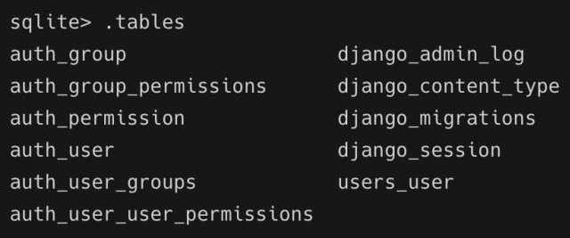
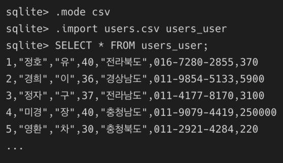
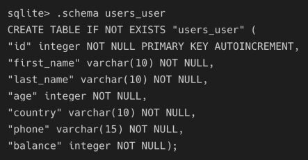
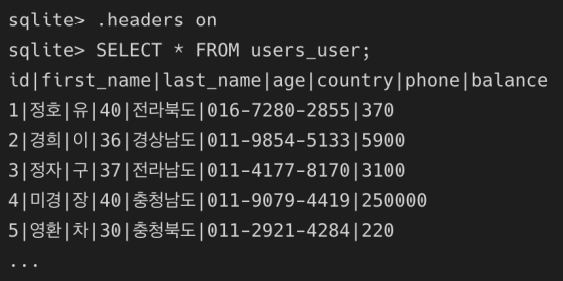
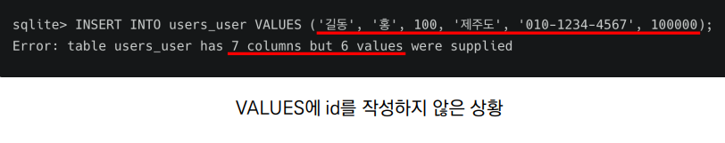
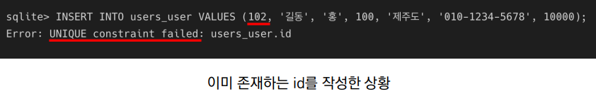
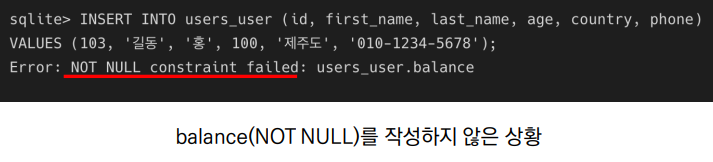

# SQL & ORM

### Django Project Setting

1. 다운로드한 django 프로젝트에서 가상 환경 적용하기
2. requirements.txt 파일로 실습 환경 구성하기

```python
$ pip install -r requirements.txt
```

3. migrate 진행하기

```python
$ python manage.py migrate
$ python manage.py sqlmigrate users 0001
```

4. db.sqlite3 실행하기

```python
$ sqlite3 db.sqlite3
```

#### sqlite 확인 및 .headers on 설정



#### csv 파일을 데이터 베이스에 적용하기



#### 스키마 확인



#### .headers on



#### shell 정리 및 종료

* in sqlite
  * shell clear
  * .exit
* in django_shell_plus
  * clear
  * exit

### CRUD

### READ

#### 모든 user 레코드 조회 - ORM

```shell
User.objects.all()
```

#### 모든 user 레코드 조회 - SQL

```sqlite
SELECT * FROM users_user;
```

### CREATE

#### user 레코드 생성 - ORM

```
User.objects.create (
	first_name='길동',
	last_name='홍',
	age=100,
	country='제주도',
	phone='010-1234-5678',
	balance=10000
)
```

#### 방금 생성한 레코드 확인하기 - SQL

```sql
SELECT * FROM users_user LIMIT 1 OFFSET 100;
```

#### user 레코드 생성 및 확인 - SQL

```sql
INSERT INTO users_user VALUES (102, '길동', '김', 100, '경상북도', '010-1234-1234', 100);
SELECT * FROM users_user LIMIT 2 OFFSET 100;
```

#### user 레코드 생성 실패 예시 1 - SQL



#### user 레코드 생성 실패 예시 2 - SQL



#### user 레코드 생성 실패 예시 3 - SQL



### READ

