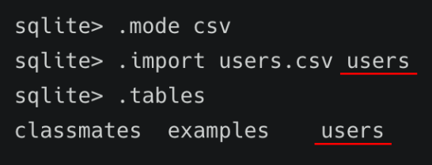

# SQL

### SQL (Structured Query Language)

* 관계형 데이터베이스 관리시스템의 **데이터 관리**를 위해 설계된 **특수 목적 프로그래밍 언어**
* 데이터베이스 스키마 생성 및 수정
* 자료의 검색 및 관리
* 데이터베이스 객체 접근 조정 관리

#### SQL 분류

| 분류                   | 개념                                                         | 예시                         |
| ---------------------- | ------------------------------------------------------------ | ---------------------------- |
| DDL - 데이터 정의 언어 | 관계형 데이터베이스 구조(테이블, 스키마)를 정의하기 위한 명령어 | CREATE DROP ALTER            |
| DML - 데이터 조작 언어 | 데이터를 저장, 조회, 수정, 삭제 등을 하기 위한 명령어        | INSERT SELECT UPDATE DELETE  |
| DCL - 데이터 제어 언어 | 데이터베이스 사용자의 권한 제어를 위해 사용하는 명령어       | GRANT REVOKE COMMIT ROLLBACK |

#### SQL keywords - Data Manipulation Language

* INSERT : 새로운 데이터 삽입(추가)
* SELECT : 저장되어있는 데이터 조회
* UPDATE : 저장되어있는 데이터 갱신
* DELETE : 저장되어있는 데이터 삭제

### 테이블 생성 및 삭제

#### 데이터베이스 생성하기

```python
$ sqlite3 tutorial.sqlite3
sqlite> .database
```

#### csv 파일을 table로 만들기

```sqlite
sqlite> .mode csv
sqlite> .import hellodb.csv examples
sqlite> .tables
examples
```

#### SELECT

```sqlite
SELECT * FROM examples;
```

#### SELECT 확인하기

```SQLITE
sqlite> SELECT * FROM examples;
1,"길동","홍",600,"충청도",010-2424-1232
```

**SELECT 문은 특정 테이블의 레코드(행) 정보를 반환!**

#### 테이블 생성 및 삭제 statement

* CREATE TABLE
  * 데이터베이스에서 테이블 생성
* DROP TABLE
  * 데이터베이스에서 테이블 제거

#### CREATE

```sqlite
CREATE TABLE classmates (
id INTEGER PRIMARY KEY,
name TEXT
);
```

#### CREATE - 테이블 생성 및 확인하기


#### 특정 테이블의 schema 조회


#### DROP

```sqlite
DROP TABLE classmates;
```

### CRUD

### CREATE

#### INSERT

```sqlite
INSERT INTO 테이블이름 (컬럼1, 컬럼2, ...) VALUES (값1, 값2, ..);

INSERT INTO classmates (name, age) VALUES ('홍길동', 23);
INSERT INTO classmates VALUES ('홍길동', 30, '서울');
```

**INSERT는 특정 테이블에 레코드(행)를 삽입(생성)!**

**모든 열에 데이터가 있는 경우 column을 명시하지 않아도 됨!**

SQLite는 따로 **PRIMARY KEY 속성의 컬럼을 작성하지 않으면** 값이 자동으로 증가하는 PK옵션을 가진 **rowid 컬럼을 정의** 

### READ

#### SELECT와 함께 사용하는 clause

* LIMIT
  * 쿼리에서 반환되는 행 수를 제한
  * 특정 행부터 시작해서 조회하기 위해 **OFFSET** 키워드와 함께 사용하기도 함
* Where
  * 쿼리에서 반환된 행에 대한 특정 검색 조건을 지정
* SELECT DISTINCT
  * 조회 결과에서 중복 행을 제거
  * DISTINCT 절은 SELECT 키워드 바로 뒤에 작성해야 함

```sqlite
SELECT 컬럼1, 컬럼2, ... FORM 테이블이름; 
```

**모든 컬럽 값이 아닌 특정 컬럼 조회하기**

#### LIMIT

```sqlite
SELECT 컬럼1, 컬럼2, ... FORM 테이블이름 LIMIT 숫자;
```

**모든 컬럼 값이 아닌 특정 컬럼만 원하는 수 만큼 데이터 조회하기**

#### OFFSET keyword

```sqlite
SELECT 컬럼1, 컬럼2, ... FROM 테이블이름 LIMIT 숫자 OFFSET 숫자;
```

**특정 부분에서 원하는 수 만큼 데이터 조회하기**

#### WHERE

```sqlite
SELECT 컬럼1, 컬럼2, ... FROM 테이블이름 WHERE 조건;
```

**특정 데이터(조건) 조회하기**

#### DISTINCT

```sqlite
SELECT DISTINCT 컬럼 FROM 테이블이름;
```

**특정 컬럼을 기준으로 중복없이 가져오기**

### DELETE

#### DELETE

```sqlite
DELETE FROM 테이블이름 WHERE 조건;
```

**조건을 통해 특정 레코드 삭제하기**

-> 어떤 기준으로 데이터를 삭제하면 좋을까?

-> **중복 불가능한 값인 rowid를 기준으로 삭제하자!**

**SQLite는 기본적으로 id를 **재사용

#### AUTOINCREMENT

* SQLite가 사용되지 않은 값이나 이전에 삭제된 행의 값을 재사용하는 것을 방지

```sqlite
CREATE TABLE 테이블이름 (
id INTEGER PRIMARY KEY AUTOINCREMENT,
...
);
```

**테이블을 생성하는 단계에서** **AUTOINCREMENT**를 통해 설정가능

### UPDATE

#### UPDATE

```sqlite
UPDATE 테이블이름 SET 컬럼1=값1, 컬럼2=값2, ... WHERE 조건;
```

**조건을 통해 특정 레코드 수정하기**

**중복 불가능한 값인 rowid를 기준으로 수정하자!**

### CRUD 정리하기

|      | 구문   | 예시                                                         |
| ---- | ------ | ------------------------------------------------------------ |
| C    | INSERT | **INSERT INTO** 테이블이름 (컬럼1, 컬럼2, ...) **VALUES** (값1, 값2); |
| R    | SELECT | **SELECT * FROM** 테이블이름 **WHERE** 조건;                 |
| U    | UPDATE | **UPDATE** 테이블이름 **SET** 컬럼1=값1, 컬럼2=값2 **WHERE** 조건; |
| D    | DELETE | **DELETE FROM** 테이블이름 **WHERE** 조건;                   |

### WHERE

#### Table users 생성

```sqlite
CREATE TABLE users (
first_name TEXT NOT NULL,
last_name TEXT NOT NULL,
age INTEGER NOT NULL,
country TEXT NOT NULL,
phone TEXT NOT NULL,
balance INTEGER NOT NULL
);
```

#### csv파일 정보를 테이블에 적용하기



```sqlite
SELECT * FROM 테이블이름 WHERE 조건;
```

### sqlite Aggregate Functions

* COUNT
  * 그룹의 항목 수를 가져옴
* AVG
  * 값 집합의 평균 값을 계산
* MAX
  * 그룹에 있는 모든 값의 최대값을 가져옴
* MIN
  * 그룹에 있는 모든 값의 최소값을 가져옴
* SUM
  * 모든 값의 합을 계산

#### COUNT

```sqlite
SELETE COUNT(컬럼) FROM 테이블이름;
```

**레코드의 개수 조회하기**

#### AVG, SUM, MIN, MAX

```SQLITE
SELECT AVG(컬럼) FROM 테이블이름;
SELECT SUM(컬럼) FROM 테이블이름;
SELECT MIN(컬럼) FROM 테이블이름;
SELECT MAX(컬럼) FROM 테이블이름;
```

**위 함수들은 기본적으로 해당 컬럼이 숫자(INTEGER)일 때만 사용 가능**

### LIKE

* 패턴 일치를 기반으로 데이터를 조회하는 방법
* sqlite는 패턴 구성을 위한 2개의 wildcards를 제공
  * % (percent sign)
    * 0개 이상의 문자
  * _ (underscore)
    * 임의의 단일 문자

```sqlite
SELECT * FROM 테이블 WHERE 컬럼 LIKE '와일드카드패턴';
```

**패턴을 확인하여 해당하는 값을 조회하기**

#### wildcards


| 와일드카드패턴 | 의미                                          |
| -------------- | --------------------------------------------- |
| 2%             | 2로 시작하는 값                               |
| %2             | 2로 끝나는 값                                 |
| %2%            | 2가 들어가는 값                               |
| _2%            | 아무 값이 하나 있고 두번 째가 2로 시작하는 값 |
| 1___           | 1로 시작하고 총 4자리인 값                    |
| 2_%\_% / 2__%  | 2로 시작하고 적어도 3자리인 값                |

### ORDER BY

* 조회 결과 집합을 정렬
* SELECT 문에 추가하여 사용
* 정렬 순서를 위한 2개의 keyword 제공
  * ASC - 오름차순 (default)
  * DESC - 내림차순

```sqlite
SELECT * FROM 테이블 ORDER BY 컬럼 ASC;
SELECT * FROM 테이블 ORDER BY 컬럼1, 컬럼2 DESC;
```

**특정 컬럼을 기준으로 데이터를 정렬해서 조회하기**

### GROUP BY

* 행 집합에서 요약 행 집합을 만듦
* SELECT 문의 optional 절
* 선택된 행 그룹을 하나 이상의 열 값으로 요약 행으로 만듦
* 문장에 WHERE 절이 포함된 경우 반드시 WHERE 절 뒤에 작성해야 함


**지정된 기준에 따라 행 세트를 그룹으로 결합 데이터를 요약하는 상황에 주로 사용**


### ALTER TABLE

ALTER TABLE의 3가지 기능

1. table 이름 변경
2. 테이블에 새로운 column 추가
3. [참고] column 이름 수정

**테이블의 이름을 변경해보자**

```sqlite
ALTER TABLE 기존테이블이름 RENAME TO 새로운테이블이름;
```

**테이블에 새로운 컬럼을 추가해보자**

```sqlite
ALTER TABLE 테이블이름 ADD COLUMN 컬럼이름 데이터타입설정;
```

**새로운 컬럼 이름은 created_at 이며, TEXT 타입에 NULL 설정!**

```sqlite
ALTER TABLE news ADD COLUMN created_at TEXT NOT NULL;
```


#### 1. NOT NULL 설정 없이 추가하기


#### 2. 기본 값(DEFAULT) 설정하기


