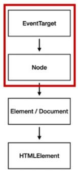
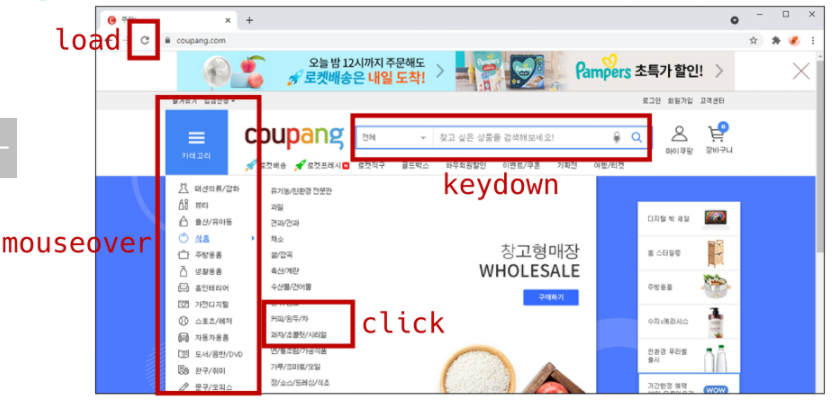

# Javascript 01

* DOM
* Event Listener

---

### DOM(Document Object Model)

* HTML, XML과 같은 문서를 다루기 위한 문서 프로그래밍 인터페이스
* 문서를 구조화하고 구조화된 구성 요소를 하나의 객체로 취급하여 다루는 논리적 트리 모델
* 문서가 구조화되어 있으며 각 요소는 객체(object)로 취급
* 단순한 속성 접근, 메서드 활용뿐만 아니라 프로그래밍 언어적 특성을 활용한 조작 가능
* 주요 객체
  * window : DOM을 표현하는 창, 가장 최상위 객체 (작성 시 생략 가능)
  * document : 페이지 컨텐츠의 Entry Point 역할을 하며, <body> 등과 같은 수많은 다른 요소들을 포함
  * navigator, location, history, screen

#### DOM - 해석

* 파싱 (Parsing)
  * 구문 분석, 해석
  * 브라우저가 문자열을 해석하여 DOM Tree로 만드는 과정 

#### BOM 이란?

* Browser Object Model
* 자바스크립트가 브라우저와 소통하기 위한 모델
* 브라우저의 창이나 프레임을 추상화해서 프로그래밍적으로 제어할 수 있도록 제공하는 수단
  * 버튼, URL 입력창, 타이틀 바 등 브라우저 윈도우 및 웹 페이지 일부분을 제어 가능
* window 객체는 모든 브라우저로부터 지원 받으며 브라우저의 창(window)를 지칭

### DOM 조작

* Document는 문서 한 장(HTML)에 해당하고 이를 조작
* DOM 조작 순서
  1. 선택 (Select)
  2. 변경 (Manipulation)

#### DOM 관련 객체의 상속 구조

* EventTarget
  * Event Listener를 가질 수 있는 객체가 구현하는 DOM 인터페이스
* Node
  * 여러 가지 DOM 타입들이 상속하는 인터페이스

* Element
  * Document 안의 모든 객체가 상속하는 가장 범용적인 기반 클래스
  * 부모인 Node와 그 부모인 EventTarget의 속성을 상속
* Document
  * 브라우저가 불러온 웹 페이지를 나타냄
  * DOM 트리의 진입점(entry point) 역할을 수행
* HTMLElement
  * 모든 종류의 HTML 요소
  * 부모 element의 속성 상속

#### DOM 선택 - 선택 관련 메서드

* Document**.querySelector(selector)**
  * 제공한 선택자와 일치하는 element 하나 선택
  * 제공한 CSS selector를 만족하는 첫 번째 element 객체를 반환 (없다면 null)
* Document**.querySelectorAll(selector)**
  * 제공한 선택자와 일치하는 여러 element를 선택
  * 매칭 할 하나 이상의 셀렉터를 포함하는 유효한 CSS selector를 인자(문자열)로 받음
  * 지정된 셀렉터에 일치하는 NodeList를 반환

* getElementById(id)
* getElementsByTagName(name)
* getElementsByClassName(names)
* **querySelector(), querySelectorAll()을 사용하는 이유**
  * id, class 그리고 tag 선택자 등을 모두 사용 가능하므로, 더 구체적이고 유연하게 선택 가능
    * document.querySelector('#id'), document.querySelectAll('.name')

#### DOM 선택 - 선택 메서드별 반환 타입

1. 단일 element
   * getElementById()
   * querySelector()
2. HTMLCollection
   * getElementsByTagName()
   * getElementsByClassName()
3. NodeList
   * querySelectorAll()

#### DOM 선택 - HTMLCollection & NodeList

* 둘 다 배열과 같이 각 항목에 접근하기 위한 index를 제공 (유사 배열)
* **HTMLCollection**
  * name, id, index 속성으로 각 항목에 접근 가능
* **NodeList**
  * index로만 각 항목에 접근 가능
  * 단, HTMLCollection과 달리 배열에서 사용하는 forEach 함수 및 다양한 메서드 사용 가능
* 둘 다 Live Collection으로 DOM의 변경사항을 실시간으로 반영하지만, querySelectorAll()에 의해 반환되는 NodeList는 Static Collection으로 실시간 반영되지 않음

#### DOM 선택 - Collection

* Live Collection
  * 문서가 바뀔 때 실시간으로 업데이트 됨
  * DOM의 변경사항을 실시간으로 collection에 반영
    * HTMLCollection, NodeList
* Static Collection (non-live)
  * DOM이 변경되어도 collection 내용에는 영향을 주지 않음
  * querySelectorAll() 의 반환 NodeList만 static collection

### Event

* 네트워크 활동이나 사용자와의 상호작용 같은 사건의 발생을 알리기 위한 객체
* 이벤트 발생
  * 마우스를 클릭하거나 키보드를 누르는 등 사용자 행동으로 발생할 수도 있음
  * 특정 메서드를 호출(Element.click())하여 프로그래밍적으로도 만들어 낼 수 있음

#### Event 기반 인터페이스

* AnimationEvent, ClipboardEvent, DragEvent 등
* **UIEvent**
  * 간단한 사용자 인터페이스 이벤트
  * Event의 상속을 받음
  * MouseEvent, KeyboardEvent, InputEvent, FocusEvent 등의 부모 객체 역할을 함

#### Event는 왜 필요한가?

#### **"~하면 ~한다."**

* 클릭하면, 경고창을 띄운다.
* 특정 이벤트가 발생하면, 할 일을 등록한다.

