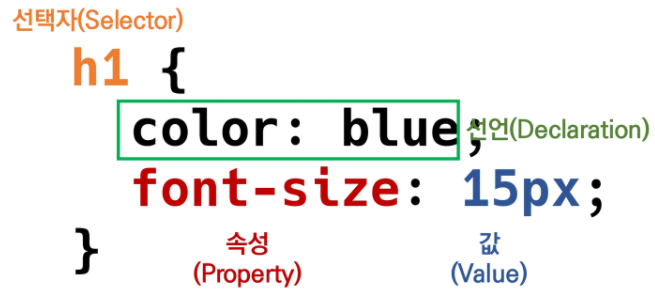
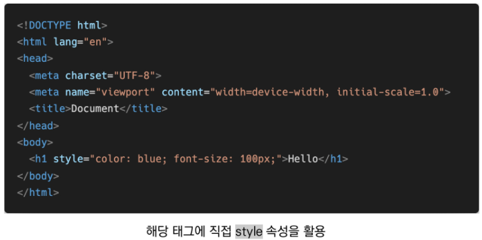
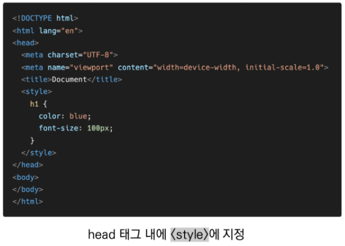
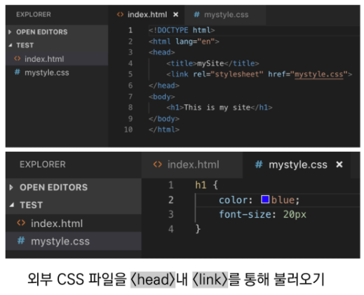

# 8월 14일 토 HTML & CSS

* 현재의 웹 표준
  * HTML5 : W3C
  * HTML Living Standard : WHATWG

## HTML (Hyper Text Markup Language)

> 웹 페이지를 작성하기 위한(구조를 잡기 위한) 언어
>
> **웹 컨텐츠의 의미와 구조를 정의**

* Hyper
  * 텍스트 등의 정보가 동일 선상에 있는 것이 아니라 다중으로 연결되어 있는 상태
* Hyper Text
  * 참조(하이퍼링크)를 통해 사용자가 한 문서에서 다른 문서로 즉시 접근할 수 있는 텍스트

* Markup language
  * 태그 등을 이용하여 문서나 데이터의 구조를 명시하는 언어
  * 프로그래밍 언어와는 다르게 단순하게 데이터를 표현하기만 한다
  * 대표적인 예 - HTML, Markdown

#### HTML 기본 구조

```html
<!DOCTYPE html>
<html lang="ko">
<head>
	<meta charset="UTF-8">
    <title>Document</title>
</head>
<body>
    <h1> 웹문서 </h1>
    <ul>
        <li>HTML</li>
        <li>CSS</li>
    </ul>
</body>
</html>
```

#### 메타 데이터를 표현하는 새로운 규약, Open Graph Protocol

* HTML 문서의 메타 데이터를 통해 문서의 정보를 전달
* 페이스북에서 만들었으며, 메타정보에 해당하는 제목, 설명 등을 쓸 수 있도록 정의


#### DOM(Document Object Model) 트리


* DOM은 문서의 구조화된 표현을 제공하며, 프로그래밍 언어가 DOM구조에 접근할 수 있는 방법을 제공하여 그들이 문서 구조, 스타일 내용 등을 변경할 수 있게 도움
* DOM은 동일한 문서를 표현하고, 저장하고, 조작하는 방법을 제공
* Web Page의 객체 지향 표현

#### 요소(element)

### **<h1>contents</h1>**

> HTML의 요소는 태그와 내용(comtents)로 구성되어 있다.

* HTML 요소는 시작 태그와 종료 태그 그리고 태그 사이에 위치한 내용으로 구성
  * 태그(Element, 요소)는 컨텐츠(내용)을 감싸는 것으로 그 정보의 성격과 의미를 정의
* 내용이 없는 태그들
  * br, hr, img, input, link, meta
* 요소는 중첩될 수 있음
  * 요소의 중첩을 통해 하나의 문서를 구조화
  * 여는 태그와 닫는 태그의 쌍을 잘 확인해야함
  * 오류를 반환하는 것이 아닌 그냥 레이아웃이 깨진 상태로 출력되기 때문에, 디버깅이 힘들어 질 수 있음

#### 속성(attribute)

### **<a href="https://google.com"></a>**

​             속성명(공백NO!)         속성값(쌍따옴표 사용!)

태그별로 사용할 수 있는 속성은 다르다.

* 속성을 통해 태그의 부가적인 정보를 설정할 수 있음
* 요소는 속성을 가질 수 있으며, 경로나 크기와 같은 추가적인 정보를 제공
* 요소의 시작 태그에 작성하며 보통 이름과 값이 하나의 쌍으로 존재
* 태그와 상관없이 사용 가능한 속성(HTML Global Attribute)들도 있음


* 모든 HTML 요소가 공통으로 사용할 수 있는 속성 (몇몇 요소에는 아무 효과가 없을 수 있음)
  * id, class
  * hidden
  * lang
  * style
  * tabindex
  * title

#### 시맨틱 태그

* HTML5에서 의미론적 요소를 담은 태그의 등장. ~~div~~
* 대표적인 태그들
  * header : 문서 전체나 섹션의 헤더(머릿말 부분)
  * nav : 내비게이션
  * aside : 사이드에 위치한 공간, 메인 콘텐츠와 관련성이 적은 콘텐츠
  * section : 문서의 일반적인 구분, 컨텐츠의 그룹을 표현
  * article : 문서, 페이지, 사이트 안에서 독립적으로 구분되는 영역
  * footer : 문서 전체나 섹션의 푸터(마지막 부분)

* 개발자 및 사용자 뿐만 아니라 검색엔진 등에 의미있는 정보의 그룹을 태그로 표현
* 단순히 구역을 나누는 것 뿐만 아니라 '의미'를 가지는 태그들을 활용하기 위한 노력
* Non semantic 요소는 div, span 등이 있으며 h1, table 태그들도 시맨틱 태그로 볼 수 있음
* 요소의 의미가 명확해지기 때문에 코드의 가독성을 높이고 유지보수를 쉽게 함
* 검색엔진최적화(SEO)를 위해서 메타태그, 시맨틱 태그 등을 통한 마크업을 효과적으로 할 필요가 있다.

#### 시맨틱 웹

* 웹 상에 존재하는 수많은 웹 페이지들에 메타데이터를 부여하여,
* 기존의 단순한 데이터의 집합이었던 웹페이지를 '의미'와 '관련성'을 가지는 거대한 데이터베이스로 구축하고자 하는 발상


## HTML 문서 구조화

* 인라인 / 블록 요소 => CSS에서 자세하게

* 그룹 컨텐츠
  * < p >
  * < hr >
  * < ol >, < ul >
  * < pre >, < blockquote >
  * < div >
* 텍스트 관련 요소
  * < a >
  * < b > vs < strong >
  * < i > vs < em >
  * < span > , < br >, < img >
* table
  * <tr> , <tb>, <th>
  * <thead>, <tbody>, <tfoot>
  * <caption>
  * 셀 병합 속성 : colspan, rowspan
  * scope 속성
  * <col>, <colgroup>
* form
  * < form >은 서버에서 처리될 데이터를 제공하는 역할
  * < form >의 기본 속성
    * action
    * method
* input
  * 다양한 타입을 가지는 입력 데이터 필드
  * < label > : 서식 입력 요소의 캡션
  * < input > 공통 속성
    * name, placeholder
    * required
    * autofocus

## CSS (Cascading Style Sheets)

스타일, 레이아웃 등을 통해 문서(HTML)를 표시하는 방법을 지정하는 언어



* CSS 구문은 선택자와 함께 열림
* 선택자를 통해 스타일을 지정할 HTML 요소를 선택
* 중괄호 안에서는 속상과 값, 하나의 쌍으로 이루어진 선언을 진행
* 각 쌍은 선택한 요소의 속성, 속성에 부여할 값을 의미
  * 속성(property) : 어떤 스타일 기능을 변경할지 결정
  * 값(value) : 어떻게 스타일 기능을 변경할지 결정

#### CSS 정의 방법

1. 인라인(inline)
2. 내부 참조(embedding) - <style>
3. 외부 참조(link file) - 분리된 CSS 파일

* CSS 정의 방법 -1 (인라인)



* CSS 정의 방법 -2 (내부참조)



* CSS 정의 방법 -3 (외부 참조)



## CSS Selectors 선택자

* HTML 문서에서 특정한 요소를 선택하여 스타일링 하기 위해서는 반드시 선택자라는 개념이 필요하다.

* 기본 선택자

  * **전체 선택자, 요소 선택자**
  * **클래스 선택자, 아이디 선택자, 속성 선택자**

* 결합자 (Combinators)

  * **자손 결합자, 자식 결합자**
  * **일반 형제 결합자, 인접 형제 결합자**

  

  

  

  

  

  

  

  

  

  

