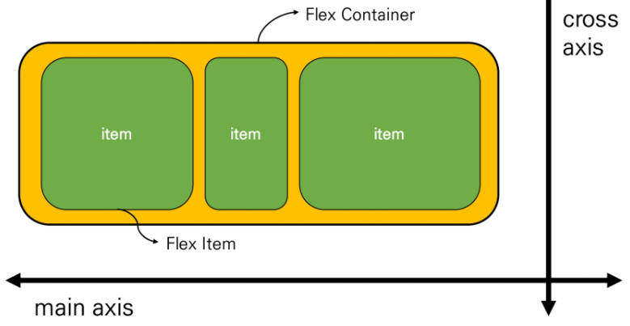
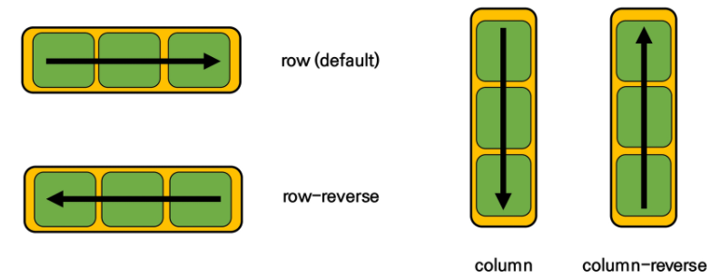
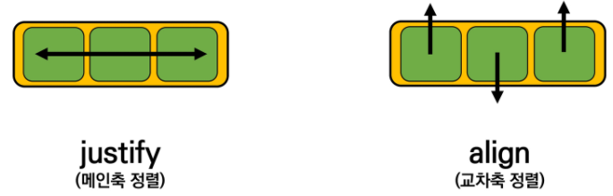
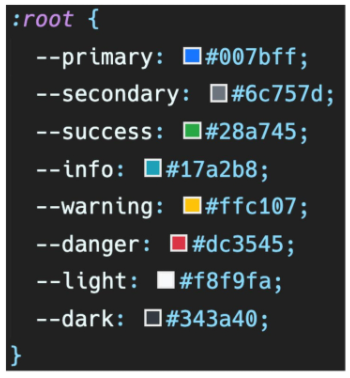

# 8월 15일 일

### Float

* 본래는 이미지 좌,우측 주변으로 텍스트를 둘러싸는 레이아웃을 위해 도입
* 더 나아가 이미지가 아닌 다른 요소들에도 적용해 웹 사이트의 전체 레이아웃을 만드는데까지 발전
* **none** : 기본값
* **left** : 요소를 왼쪽으로 띄움
* **right** : 요소를 오른쪽으로 띄움

#### Float clear

* 선택한 요소의 맨 마지막 자식으로 가상 요소를 하나 생성
* 보통 content 속성과 함께 짝지어, 요소에 장식용 콘텐츠를 추가할 때 사용
* 기본값은 inline

```html
.clearfix::after {
	content: "";    
	display: block;
	clear: both;
}
```

#### Float 정리

* flexbox 및 그리드 레이아웃과 같은 기술이 나오기 이전에 Float은 열 레이아웃을 만드는데 사용됨
* flexbox와 grid의 출현과 함께 결국 원래 텍스트 블록 내에서 float 이미지를 위한 역할로 돌아감
* 웹에서 여전히 사용하는 경우도 있음

### Flexbox

#### CSS Flexible Box Layout

* 요소 간 공간 배분과 정렬 기능을 위한 1차원(단방향) 레이아웃
* 크게 딱 2가지만 기억하자 **요소와 축!**
* 요소
  * Flex Container (부모 요소)
  * Flex Item (자식 요소)
* 축
  * main axis (메인축)
  * cross axis (교차축)



* Flex Container (부모 요소)
  * flexbox 레이아웃을 형성하는 가장 기본적인 모델
  * Flex Item들이 놓여있는 영역
  * display 속성을 flex 혹은 inline-flex로 지정
* Flex Item (자식 요소)
  * 컨테이너의 컨텐츠

### Flex 에 적용하는 속성

* 배치 방향 설정
  * flex-direction
* 메인축 방향 정렬
  * justify-content
* 교차축 방향 정렬
  * align-items, align-self, align-content
* 기타
  * flex-wrap, flex-flow, flex-frow, order

#### flex-direction

* main-axis 방향만 바뀐다
* flexbox는 단방향 레이아웃이기 때문이다





#### content & items &self

* content
  * 여러 줄
* items
  * 한 줄
* self
  * flex item 개별 요소
* 예시
  * justify-content : 메인축 기준 여러 줄 정렬
  * align-items : 교차축 기준 한 줄 정렬
  * align-self : 교차축 기준 선택한 요소 하나 정렬

### 정리

* display : flex

  * **정렬하려는 부모 요소에 작성**
  * inline-flex : flex 영역을 블록으로 쓰지 않고 인라인 블록으로 사용

* flex-direction

  * **item이 쌓이는 방향 설정**
  * main-axis 가 변경됨
  * row(기본값) : 주축의 방향이 왼쪽에서 오른쪽
  * row-reverse : 주축의 방향이 오른쪽에서 왼쪽
  * column : 주축의 방향이 위에서 아래
  * column-reverse : 주축의 방향이 아래에서 위

* flex-wrap

  * **요소들이 강제로 한 줄에 배치되게 할 것인지 여부 설정**
  * nowrap (기본 값) : **모든 아이템들 한 줄에 나타내려고 함 -> 그래서 자리가 없어도 튀어나옴**
  * wrap : **넘치면 그 다음 줄로**
  * wrap-reverse : **넘치면 그 윗줄로(역순)**

* flex-flow

  * flex-direction 과 flex-wrap 의 shorthand
  * flex-direction 과 flex-wrap에 대한 설정 값을 차례로 작성

* justify-content

  * main 축 정렬
  * flex-start (기본 값) : 시작 지점부터 차례로 쌓임
  * flex-end : **쌓이는 방향이 뒤쪽부터 시작** (순서가 역순이 되는게 아니라 아이템들이 뒤로 몰리는 형식)
  * center : 정 중 앙
  * space-between : 좌우 정렬 (item들 간의 간격이 동일)
  * space-around : 균등 좌우 정렬 
  * space-evenly : 균등 정렬

* align-items

  * cross 축 정렬
  * stretch(기본 값) : 컨테이너를 가득 채움
  * flex-start : 위
  * flex-end : 아래
  * center : 가운데
  * baseline : item 내부의 text에 기준선을 맞춤

* align-self

  * 개별 item에 적용하는 속성
  * auto (기본 값)
  * flex-start
  * flex-end
  * center
  * baseline
  * stretch : 부모 컨테이너에 자동으로 맞춰서 늘어남

* order

  * 작은 숫자 일수록 앞(우선 쌓이는 방향)으로 이동
  * 기본 값: 0

* flex-grow

  * 주축에서 남는 공간을 항목들에게 분배하는 방법
  * 각 아이템의 상대적 비율을 정하는 것은 아님
  * 기본 값 : 0
  * 음수 불가능

  ### Bootstrap
  
  #### CDN
  
  Content Delivery(Distribution) Network
  
  컨텐츠(CSS, JS, Image, Text등)을 효율적으로 전달하기 위해 여러 노드에 가진 네트워크에 데이터를 제공하는 시스템

| class name | rem  | px   |
| ---------- | ---- | ---- |
| m-1        | 0.25 | 4    |
| m-2        | 0.5  | 8    |
| m-3        | 1    | 16   |
| m-4        | 1.5  | 24   |
| m-5        | 3    | 48   |

.mx-auto : 수평 중앙 정렬


| m    | margin  |
| ---- | ------- |
| p    | padding |

| t    | top         |
| ---- | ----------- |
| b    | bottom      |
| s    | left        |
| e    | right       |
| x    | left, right |
| y    | top, bottom |



#### Responsive Web Design

* 다양한 화면 크기를 가진 디바이스들이 등장함에 따라 responsive web design 개념이 등장
* 반응형 웹은 별도의 기술 이름이 아닌 웹 디자인에 대한 접근 방식, 반응형 레이아웃 작성에 도움이 되는 사례들의 모음 등을 기술하는데 사용되는 용어
* 예시
  * media queries, flexbox, bootstrap grid system, the viewport meta tag

#### Grid system

* bootstrap grid system은 flexbox로 제작됨
* `container`, `rows`, `column` 으로 컨텐츠를 배치하고 정렬
* 반드시 기억해야 할 2가지 !
  * 12개의 column
  * 6개의 grid breakpoints
