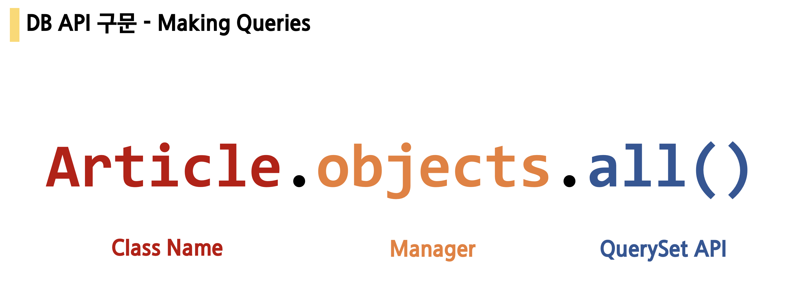

# Django_2

### Django Model

* 목차

1. Model
2. ORM
3. Migrations
4. Database API
5. CRUD
6. Admin Site

-----------------------------------

#### Model

> 웹 어플리케이션의 데이터를 구조화하고 조작하기 위한 도구

* 단일한 데이터에 대한 정보를 가짐
  * 사용자가 저장하는 데이터들의 필수적인 필드들과 동작들을 포함
* 저장된 데이터베이스의 구조(layout)
* django는 model을 통해 데이터에 접속하고 관리
* 일반적으로 각각의 model은 하나의 데이터베이스 테이블에 매핑 됨

#### Database

> 체계화된 데이터의 모임

* `쿼리(Query)`
  * 데이터를 조회하기 위한 명령어
  * 조건에 맞는 데이터를 추출하거나 조작하는 명령어
  * "Query를 날린다." -> DB를 조작한다.


**기본 구조**

* `스키마(Schema)` -> 뼈대(Structure)
  * 데이터베이스에서 자료의 구조, 표현방법, 관계 등을 정의한 구조
* `테이블(Table)` -> 관계(Relation) -> 엑셀의 Sheet
  * 열(column) : 필드(field) or 속성
    * 각 열에는 고유한 데이터 형식이 지정된다. 
  * 행(row) : 레코드(record) or 튜플
    * 테이블의 데이터는 행에 저장된다.

* **PK(기본키)**
  * 각 행의 고유값으로 primary key로 불린다.
  * 반드시 설정하여야하며, 데이터베이스 관리 및 관계 설정시 주요하게 활용된다.


----

### ORM

> 객체-관계 mapping

* Object-Relational-Mapping
* 객체 지향 프로그래밍 언어를 사용하여 호환되지 않는 유형의 시스템 간에(Django - SQL)데이터를 변환하는 프로그래밍 기술
* OOP 프로그래밍에서 RDBMS을 연동할 때, 데이터베이스와 객체 지향 프로그래밍 언어 간의 호환되지 않는 데이터를 변환하는 프로그래밍 기법
* Django는 내장 Django ORM을 사용함

**장/단점**

* 장점
  * SQL을 잘 알지 못해도 DB 조작이 가능
  * SQL의 절차적 접근이 아닌 객체 지향적 접근으로 인한 높은 생산성
* 단점
  * ORM 만으로 완전한 서비스를 구현하기 어려운 경우가 있음

**정리**

* 객체 지향 프로그래밍에서 DB를 편리하게 관리하기위해 ORM 프레임워크를 도입
* **"우리는 DB를 객체(object)롤 조작하기 위해 ORM을 사용한다"**

#### models.py

```django
# articles/models.py

class Article(models.Model): # Model class 상속
	# id는 기본적으로 처음 테이블 생성시 자동으로 만들어진다.
	title = models.CharField(max_length=10) # 클래스 변수(DB의 필드)
	content = models.TextField()
```

* DB 컬럼과 어떠한 타입으로 정의할 것인지에 대해 django.db 라는 모듈의 models 를 상속
  * 각 모델은 `django.db.models.Model` 클래스의 서브 클래스로 표현
* title과 content는 모델의 필드(컬럼)을 나타냄
  * 각 필드는 클래스 속성으로 지정되어 있으며, 각 속성은 각 데이터베이스의 열에 매핑

#### Migrations

> django가 model에 생긴 변화를 반영하는 방법

**makemigrations**

> migration 파일은 데이터베이스 스키마를 위한 버전관리 시스템이라 생각하자

* 모델을 변경한 것에 기반한 새로운 migration(설계도) 만들 때 사용
* 모델을 활성화 하기 전에 DB 설계도 작성

```python
$ python manage.py makemigrations
```

* `0001_initial.py` 생성 확인

**migrate**

> 설계도를 실제 DB에 반영하는 과정

* `migrate`는 `makemigrations`로 만든 설계도를 실제 `db.sqlite3` DB에 반영한다.
* 모델에서의 변경 사항들과  DB의 스키마가 동기화를 이룬다.

```python
$ python manage.py sqlmigrate app_name 0001
```

**showmigrations**

* migrations 설계도들이 migrate 됐는지 안됐는지 여부를 확인 할 수 있다.

```python
$ python manage.py makemigrations
```

**Model 작성 과정 3단계**

* `models.py` : 변경사항 발생 (생성/수정)
* `makemigrations` : migration 파일 만들기 (설계도)
* `migrate` : DB에 적용 (테이블 생성)

----

#### DB API 구문 - Making Queries



----

#### CRUD

> 대부분의 컴퓨터 소프트웨어가 가지는 기본적인 데이터 처리 기능인 Create(생성), Read(읽기), Update(갱신), Delete(삭제)를 묶어서 일컫는 말
>
> 이러한 4개의 조작을 모두 할 수 없다면 그 소프트웨어는 완전하다고 할 수 없다.
>
> 이들 기능은 매우 기본적이기 때문에 한 묶음으로 설명되는 경우가 많다.

#### Create

> django shell_plus 에서 진행

`__str__`

* 모든 모델마다 표준 파이썬 클래스의 메소드인 **str()** 을 정의하여 각각의 object가 사람이 읽을 수 있는 문자열을 반환(return)하도록 한다.

```django
# articles/models.py

class Article(models.Model):
    title = models.CharField(max_length=10)
    content = models.TextField()
    created_at = models.DateTimeField(auto_now_add=True)
    updated_at = models.DateTimeField(auto_now=True)

    def __str__(self):
        return self.title
```

`save()`

* Saving objects
* 객체를 데이터베이스에 저장함
* 데이터 생성 시 save()를 호출하기 전에는 객체의 ID 값이 무엇인지 알 수 없음
  * ID 값은 django가 아니라 DB에서 계산되기 때문
* 단순히 모델을 인스턴스화 하는 것은 DB에 영향을 미치지 않기 때문에 반드시 save()가 필요

#### Read

`all()`

* 현재 QuerySet의 복사본을 반환

```python
Article.objects.all()
```

`get()`

* 주어진 lookup 매개변수와 일치하는 객체를 반환
* 객체를 찾을 수 없으면 DoesNotExist 예외를 발생시키고, 둘 이상의 객체를 찾으면 MultipleObjectReturned 예외를 발생시킴
* 위와 같은 특징을 가지고 있기 때문에 primary key와 같이 고유성을 보장하는 조회에서 사용해야 함

`filter()`

* 주어진 lookup 매개변수와 일치하는 객체를 포함하는 새 QuerySet을 반환

#### Update

```django
>>> article = Article.objects.get(pk=1)
>>> article.title
'first'

# 값을 변경하고 저장
>>> article.title = 'byebye'
>>> article.save()

# 정상적으로 변경된 것을 확인
>>> article.title
'byebye'
```

#### Delete

```
>>> article = Article.objects.get(pk=1)

# 삭제
>>> article.delete()
(1, {'articles.Article': 1})

# 다시 1번 글을 찾으려고 하면 없다고 나온다.
>>> Article.objects.get(pk=1)
DoesNotExist: Article matching query does not exist.
```

---

### Http Method - POST

* 3가지 이유에서 우리는 글을 작성할 때 GET 요청이 아닌 POST 요청을 해야 한다.

1. 사용자는 Django에게 '**HTML 파일 줘(GET)**' 가 아니라 '**~한 레코드(글)을 생성해(POST)**' 이기 때문에 GET보다는 POST 요청이 맞다.
2. 데이터는 URL에 직접 노출되면 안된다. (우리가 주소창으로 접근하는 방식은 모두 GET 요청) query의 형태를 통해 DB schema를 유추할 수 있다.
3. 모델(DB)을 건드리는 친구는 GET이 아닌 POST 요청! 왜? 중요하니까 **최소한의 신원 확인**이 필요하다.

`POST`

* 서버로 데이터를 전송할 때 사용
* 서버에 변경사항을 만듦
  * 때문에 요청자에 대한 최소한의 검증을 하지 않으면 부작용을 일으킬 수 있음
  * `csrf_token`을 통해서 요청자의 최소한의 신원확인
* 리소스를 생성/변경하기 위해 데이터를 HTTP body에 담아 전송
* CRUD 에서 C/U/D 역할을 담당

`GET`

* 특정 리소스를 가져오도록 요청할 때 사용
* 반드시 데이터를 가져올 때만 사용해야 함
* DB에 변화를 주지 않음
* CRUD 에서 R 역할을 담당

#### CSRF Token

* 사이트 간 요청 위조
  * 웹 애플리케이션 취약점 중 하나로 **사용자가 자신의 의지와 무관하게 공격자가 의도한 행동을 하여 특정 웹페이지를 보안에 취약하게 한다거나 수정, 삭제 등의 작업을 하게 만드는 공격 방법**을 의미한다.
  * ``을 설정하면 input type hidden 으로 특정한 hash 값이 들어있다.
* `` 이 없다면?
* `403 forbidden` 에러: 서버에 요청은 도달했으나 서버가 접근을 거부할 때 반환하는 HTTP 응답 코드 / 오류 코드, 서버 자체 또는 서버에 있는 파일에 접근할 권한이 없을 경우에 발생
  * 이러한 접근을 할 수 있도록 하는 것이 `` -> 사내 인트라넷 서버를 사내가 아닌 밖에서 접속하려고 할 때도 해당 HTTP 응답 코드가 뜬다.

----

**게시글 작성 후 index로 되돌리기**

```
# articles/views.py

def create(request):
    ...
    return render(request, 'articles/index.html')
```

* 문제점 발생

1. 글을 작성 후 index 페이지가 출력되지만 게시글이 조회되지 않음

2. URL은 여전히 create에 머물러 있음

   > 즉, 단순히 index 페이지만 render 되었을 뿐이고 url이 돌아가지 못했기때문 index view 함수로 요청을 보내서 랜더링 된 것 이 아님!

#### Redirect

> Django shortcut function 중 하나이며 model, view name, absolute or relate URL을 인자로 받음
>
> 여기저 인자 view name은 URL pattern name으로 작성 될 수 있음

* POST 요청은 HTML 문서를 랜더링 하는 것이 아니라 **'~~좀 처리해줘(요청)'의 의미이기 때문에 요청을 처리하고 나서의 요청의 결과를 보기 위한 페이지로 바로 넘겨주는 것이 일반적**이다.

```
# articles/views.py

from django.shortcuts import render, redirect


def create(request):
    title = request.POST.get('title') 
    content = request.POST.get('content')
    
    article = Article(title=title, content=content)
    article.save()
    
    return redirect('articles:index')
```

**POST 요청으로 변경 후 변화하는 것**

* POST 요청을 하게 되면 form을 통해 전송한 데이터를 받을 때도 `request.POST.get()` 로 받아야 함
* 글이 작성되면 실제로 주소 창에 내가 넘긴 데이터가 나타나지 않는다. (POST 요청은 HTTP body에 데이터를 전송함)
* POST 는 html을 요청하는 것이 아니기 때문에 html파일을 받아볼 수 있는 곳으로 다시 redirect한다.

