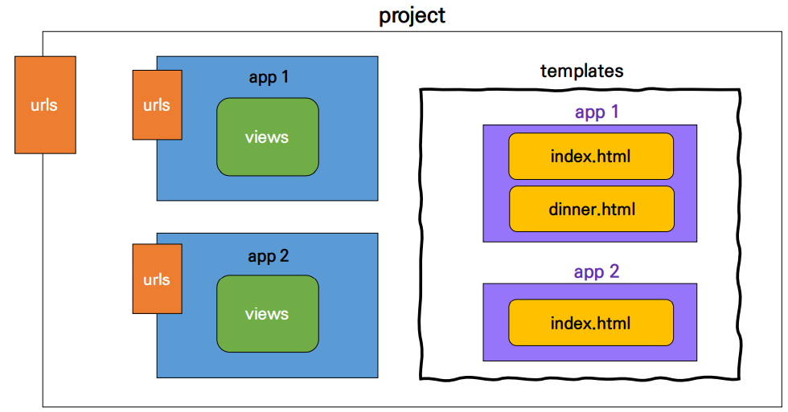

# Django Intro

> Django 시작하기

* Django 설치 전 **가상환경 생성 및 활성화**

```python
$ pip install django # 설치
$ pip list # 설치 확인
```

* 메인 페이지 로켓 확인

> 프로젝트 생성 및 구조

```python
$ django-admin startproject first_project 
# first_project라는 이름이 프로젝트 생성
$ python manage.py runserver # 서버 실행
```

* `__init__.py`

  * python에게 이 디렉토리를 하나의 python 패키지로 다루도록 지시

* `asgi.py`

  * asynchronous server gateway interface
  * django 애플리케이션이 비동기식 웹 서버와 연결 및 소통하는 것을 도움

* `settings.py`

  * 웹사이트의 모든 설정을 포함

* `urls.py`

  * 사이트의 url과 적절한 views의 연결을 지정

* `wsgi.py`

  * web server gateway interface
  * django 애플리케이션이 웹서버와 연결 및 소통하는 것을 도움

* `manage.py`

  * django 프로젝트와 다양한 방법으로 상호작용 하는 커맨드라인 유틸리티

  * ```python
    $ python manage.py <command> [options]
    ```

> Application 생성 및 구조

```python
$ python manage.py startapp articles
```

**Application (app)**

* 프로젝트는 app의 집합이고, 실제 요청을 처리하고 페이지를 보여주고 하는 것들은 이 app의 역할
* **복수형** 으로 하는 것을 권장

**Application 구조**

* `admin.py`
  * 관리자용 페이지를 설정 하는 곳

* `apps.py`
  * 앱의 정보가 작성된 곳
* `models.py`
  * 앱에서 사용하는 model(DB)을 정의하는 곳
* `tests.py`
  * 프로젝트의 테스트 코드를 작성하는 곳
* `views.py`
  * view 함수들이 정의 되는 곳

#### Application 등록

> 반드시 **app 생성 후 등록** 순서를 지켜야한다.

```django
INSTALLED_APPS = [
    # local apps
    'movies',

    # 3rd party apps
    'django_extensions',
    
    # django apps
    'django.contrib.admin',
    'django.contrib.auth',
    'django.contrib.contenttypes',
    'django.contrib.sessions',
    'django.contrib.messages',
    'django.contrib.staticfiles',
]
```

* 프로젝트에서 앱을 사용하기 위해서는 반드시 INSTALLED_APPS 리스트에 추가해야 함
* **INSTALLED_APPS**
  * Django installation에 활성화 된 모든 앱을 지정하는 문자열 목록

----------------------------------------

### MTV 디자인 패턴

#### model

* 응용프로그램의 데이터 구조를 정의하고 데이터베이스의 기록을 관리(추가, 수정, 삭제)

#### View

* HTTP 요청을 수신하고 HTTP 응답을 반환하는 함수 작성
* Model을 통해 요청에 맞는 필요 데이터에 접근
* Template에게 HTTP 응답 서식을 맡김

#### Templates

* 실제 내용을 보여주는데 사용되는 파일
* 파일의 구조나 레이아웃을 정의
* Template 파일 경로의 기본 값은 **app 폴더 안의 templates 폴더**로 지정되어 있음

**.py 3대장 기억하기**

* `urls.py` : 주소(URL) 관리
* `views.py` : 페이지 관리 (페이지 하나 당, 하나의 함수)
* `models.py` : 데이터베이스 관리

---------------------------------

#### 요청과 응답

**urls.py**

* 장고 서버로 요청(request)이 들어오면 그 요청이 어디로 가야하는지 인식하고 관련된 함수(view)로 넘겨준다.
* `views.py` 에서 만든 함수를 연결시켜준다.

**views.py**

* HTTP 요청을 수신하고 HTTP 응답을 반환하는 함수 작성
* Model을 통해 요청에 맞는 필요 데이터에 접근
* templates에게 HTTP 응답 서식을 맡김

**Templates**

* `views.py`에서 지정한 `intex.html` 파일을 만든다.
* Django에 설정된 template의 기본 경로는 **app 폴더 안의 templates 폴더**이다.

----

### Template

#### Django Template Language (DTL)

* 단순히 python이 HTML에 포함 된 것이 아니며, 프로그래밍적 로직이 아니라 **프레젠테이션을 표현하기 위한 것**

> DTL Syntax

1. Variable
2. Filters
3. Tags
4. Comments

#### DTL Syntax - Variable

```django
{{ varible }}
```

* render()를 사용하여 views.py에서 정의한 변수를 template 파일로 넘겨 사용하는 것
* dot(.)를 사용하여 변수 속성에 접근할 수 있음
* render()의 세번째 인자로 {'key': value} 와 같이 딕셔너리 형태로 넘겨주며, 여기서 정의한 key에 해당하는 문자열이 template에서 사용 가능한 변수명이 됨

#### DTL Syntax - Filters

```django
{{ variable|filter }}
```

* 표시할 변수를 수정할 때 사용

#### DTL Syntax - Tags

```django

```

* 출력 텍스트를 만들거나, 반복 또는 논리를 수행하여 제어 흐름을 만드는 등 변수보다 복잡한 일들을 수행
* 일부 태그는 시작과 종료 태그가 필요

```django

```

#### DTL Syntax - Comments

```django
{# #} # 한줄 주석

  여러줄 주석

```

#### **코드 작성 순서**

* 데이터의 흐름에 맞추어 작성

1. urls.py
2. views.py
3. templates

#### Template inheritance (템플릿 상속)

* 템플릿 상속은 기본적으로 코드의 재사용성에 초점을 맞춤
* 템플릿 상속을 사용하면 사이트의 모든 공통 요소를 포함하고, 하위 템플릿이 재정의(override) 할 수 있는 블록을 정의하는 기본 "skeleton" 템플릿을 만들 수 있음
  * `app_name/templates` 기본경로 외 추가 경로 설정하기

```django
# settings.py

TEMPLATES = [
    {
        ...,
        'DIRS': [BASE_DIR / 'templates'],  
...
]
```

> Template inheritance = "tags"

```

```

* 자식(하위)템플릿이 부모 템플릿을 확장한다는 것을 알림
* 반드시 템플릿 최상단에 작성 되어야 함

```
 
```

* 하위 템플릿에서 재지정(overriden)할 수 있는 블록을 정의
* 하위 템플릿이 채울 수 있는 공간

----------------------------

### HTML Form

#### throw & catch

* throw

```django
# first_project/urls.py

path('throw/', views.throw),
```

```django
# articles/views.py

def throw(request):
	return render(request, 'throw.html')
```

```django
# articles/tmplates/throw.html

<form action="/catch" method="GET">
    <label for="message">Throw</label>
    <input type="text" id="message" name="message">
    <input type="submit">
</form>
```

* catch

```django
# first_project/urls.py

path('catch/', views.catch),
```

```django
# articles/views.py

def catch(request):
	message = request.GET.get('message')
	context = {
		'message': message,
	}
	return render(request, 'catch.html', context)
```

```django
# articles/templates/catch.html

<h1>내가 받은 메세지는 {{ message }}야!</h1>
<a href="/throw/">뒤로</a>
```

#### HTML "form" element

* 웹에서 사용자 정보를 입력하는 여러 방식(text, button, checkbox, file, hidden, image, password, radio, reset, submit)을 제공하고, 사용자로부터 할당된 데이터를 서버로 전송하는 역할을 담당
* 핵심 속성(attribute)
  * **action** : 입력 데이터가 전송될 URL 지정
  * **method** : 입력 데이터 전달 방식 지정

#### HTML "input" element

* 사용자로부터 데이터를 입력 받기 위해 사용
* type 속성에 따라 동작 방식이 달라짐
* 핵심 속성(attribute)
  * **name**
  * 중복 가능, 양식을 제출했을 때 name이라는 이름에 설정된 값을 넘겨서 값을 가져올 수 있음
  * 주요 용도는 GET/POST 방식으로 서버에 전달하는 파라미터(neme은 key, value는 value)로 **?key=value&key=value** 형태로 전달됨

#### HTML "label" element

* 사용자 인터페이스 항목에 대한 설명(caption)을 나타냄
* label을 input 요소와 연결하기
  1.  input에 id 속성 부여
  2.  label에는 input의 id와 동일한 값의 for 속성이 필요
* label과 input 요소 연결의 주요 이점
  * 시각적인 기능 뿐만 아니라 화면 리더기에서 label을 읽어서 사용자가 입력해야 하는 텍스트가 무엇인지 더 쉽게 이해할 수 있도록 돕는 프로그래밍적 이점도 있음
  * label을 클릭해서 input에 초점을 맞추거나 활성화 시킬 수 있음

#### HTML "for" attribute

* for 속성의 값과 일치하는 id를 가진 문서의 첫 번째 요소를 제어
  * 연결 된 요소가 labelable elements인 경우 이 요소에 대한 labeled control이 됨
* "labelable elements"
  * label 요소와 연결할 수 있는 요소
  * button, input, select, textarea ...

#### HTML "id" attribute

* 전체 문서에서 고유(must unique)해야 하는 식별자를 정의
* 사용 목적
  * linking, scripting, styling 시 요소를 식별

#### HTTP

* Hypertext trasfer protocol
* 웹에서 이루어지는 모든 데이터 교환의 기초
* 주어진 리소스가 수행 할 원하는 작업을 나타내는 request methods를 정의
* HTTP request method 종류
  * GET, POST, PUT, DELETE ...

#### HTTP request method = "GET"

* 서버로부터 **정보를 조회**하는 데 사용
* 데이터를 가져올 때만 사용해야 함
* 데이터를 서버로 전송할 때 body가 아닌 Query String Parameters를 통해 전송
* 우리는 서버에 요청을 하면 HTML 문서 파일 한 장을 받는데, 이때 사용하는 요청의 방식이 GET

-----------------------------------------------

### URL

#### Variable Routing

* URL 주소를 변수로 사용하는 것
* 동적 라우팅
* URL의 일부를 변수로 지정하여 view 함수의 인자로 넘길 수 있음
* 변수 값에 따라 하나의 path()에 여러 페이지를 연결 시킬 수 있음

#### App URL mapping

> 하나의 프로젝트의 여러 앱이 존재한다면, 각각의 앱 안에 urls.py을 만들고 프로젝트 urls.py에서 각 앱의 urls.py 파일로 URL 매핑을 위탁하게 가능

* app의 view 함수가 많아지면서 사용하는 path() 또한 많아지고, app 또한 더 많이 작성되기 때문에 프로젝트의 urls.py에서 모두 관리하는 것은 프로젝트 유지보수에 좋지 않음
* 이제는 **각 app에 urls.py를 작성** 하게 됨


* urlpattern은 언제든지 다른 URLconf 모듈을 포함(include)할 수 있음

#### Including other URLconfs

* **include()**
  * 다른 URLconf(app1/urls.py)들을 참조할 수 있도록 도움
  * 함수 include()를 만나게 되면, URL의 그 시점까지 일치하는 부분을 잘라내고, 남은 문자열 부분을 후속 처리하기 위해 include된 URLconf로 전달
  * **django는 명시적 상대경로 (from .module import ..)를 권장**

#### Naming URL patterns

* 이제는 링크에 url을 직접 작성하는 것이 아니라 path() 함수의 name 인자를 정의해서 사용
* Django Template Tag 중 하나인 url 태그를 사용해서 path() 함수에 작성한 name을 사용할 수 있음 
* url 설정에 정의된 특정한 경로들의 의존성을 제거할 수 있음


* the 'name' value as called by the **** template tag

----------------------------------

### namespace 

> 개체를 구분할 수 있는 범위를 나타내는 namespace

**두번째 app의 index 페이지 작성**

```djan
# pages/urls.py

from django.urls import path
from . import views 


urlpatterns = [
    path('index/', views.index, name='index'),
]
```

```django
# pages/views.py

def index(request):
    return render(request, 'index.html')
```

```django
<!-- pages/templates/index.html -->




  <h1>두번째 앱의 index</h1>

```

```django
<!-- articles/templates/index.html -->




  <h1>만나서 반가워요!</h1>
  <a href="">greeting</a>
  <a href="">dinner</a>
  <a href="">dtl-practice</a>
  <a href="">throw</a>

  <h2><a href="">두번째 앱 index로 이동</a></h2>


```

**2가지 문제 발생**

1. articles app index 페이지에서 두번째 앱 index로 이동 하이퍼 링크를 클릭 시 현재 페이지로 이동
   * URL namespace
2. pages app index url로 이동해도 articles app의 index 페이지가 출력됨
   * Template namespace

#### URL namespace

* URL namespace를 사용하면 서로 다른 앱에서 동일한 URL 이름을 사용하는 경우에도 이름이 지정된 URL을 고유하게 사용할 수 있음
* urls.py에 **"app_name"** attribute 값 작성

```django
# pages/urls.py

app_name = 'pages'
urlpatterns = [
    path('index/', views.index, name='index'),
]
```

```django
# articles/urls.py

app_name = 'articles'
urlpatterns = [
    ...,
]
```

**URL tag 변경**

```django
<!-- articles/templates/index.html -->




  <h1>만나서 반가워요!</h1>
  <a href="">greeting</a>
  <a href="">dinner</a>
  <a href="">throw</a>

  <h2><a href="">두번째 앱 index로 이동</a></h2>

```


#### Template namespace

* Django는 기본적으로 **app_name/templates/** 경로에 있는 templates 파일들만 찾을 수 있으며, INSTALLED_APPS에 작성한 app 순서로 template을 검색 후 랜더링 함
* 그래서 임의로 templates의 폴더 구조를 **app_name/templates/app_name** 형태로 변경해 임의로 이름 공간을 생성 후 변경된 추가 경로로 수정

```django
# articles/views.py

return render(request, 'articles/index.html')
```

```django
# pages/views.py

return render(request, 'pages/index.html')
```



