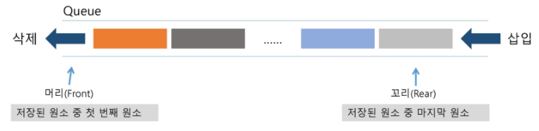

# 큐(Queue)

### 큐

> 뒤에서는 삽입만하고, 앞에서는 삭제만 이루어지는 구조
>
> 선입선출구조(FIFO : First In First Out)



#### 큐의 기본 연산

삽입 : enQueue

삭제 : deQueue

#### 큐의 주요 연산

| 연산          | 기능                                         |
| ------------- | -------------------------------------------- |
| enQueue(item) | 큐의 뒤쪽에 원소를 삽입하는 연산             |
| deQueue()     | 큐의 앞쪽에서 원소를 삭제하고 반환하는 연산  |
| createQueue() | 공백 상태의 큐를 생성하는 연산               |
| isEmpty()     | 큐가 공백상태인지를 확인하는 연산            |
| isFull()      | 큐가 포화상태인지를 확인하는 연산            |
| Qpeek()       | 큐의 앞쪽에서 원소를 삭제 없이 반환하는 연산 |

#### 선형큐

> 1차원 리스트를 이용

* 큐의 크기 = 리스트의 크기
* front : 저장된 첫 번째 원소의 인덱스 (마지막으로 꺼낸 자리)
* rear : 저장된 마지막 원소의 인덱스 (마지막으로 저장된 자리)
* 초기 상태 : front =rear = -1 (비어있어서 저장된 원소가 없음)
* 공백 상태 : front = rear (연산 진행중의 공백 상태)
* 포화 상태 : rear = n-1 (n : 리스트의 크기, n-1 : 리스트의 마지막 자리 인덱스)
  * rear 값이 큐의 마지막 위치 값이 되어있는 경우 큐가 가득차있음

**구현**

* 초기 공백 큐 생성

  * 크기 n인 1차원 배열 생성
  * front, rear = -1 로 초기화

* enQueue(item)

  ```python
  def enQueue(item):
      global rear
      if isFull():
          print("Queue_Full")
      else:              # 마지막 원소 뒤에 새로운 원소를 삽입하기 위해서는
          rear += 1      # rear값을 하나 증가시켜 새로운 원소를 삽입할 자리를 마련함
          Q[rear] = item # 그 인덱스에 해당하는 리스트 원소 Q[rear]에 item을 저장
  ```

* deQueue()

  ```python
  def deQueue(item):
      global rear
      if isEmpty():
          print("Queue_Empty")
      else:               # 가장 앞에 있는 원소를 삭제하기 위해
          front += 1      # front 값을 하나 증가시켜 큐에 남아있는 첫 번째 원소로 이동함
          return Q[front] # 새로운 첫 번째 원소를 리턴함으로써 삭제와 동일한 기능함 
  ```

* isEmpty(), isFull()

  ```python
  def isEmpty():
      return front == rear
  def isFull():
      return rear == len(Q)-1
  ```

* Qpeek()

  ```python
  def Qpeek():
      if isEmpty():            # 가장 앞에 있는 원소를 검색하여 확인
          print("Queue_Empty")
      else:       
          return Q[front+1]    # 현재 front의 한자리 뒤에있는 원소, 즉 큐의 첫번째에 있는 원소반환
  ```

**선형 큐의 문제점 : 잘못된 포화 상태 인식**

> 선형 큐를 이용하여 원소의 삽입과 삭제를 계속할 경우, 배열의 앞부분에 활용할 수 있는 공간이 있음에도 불구하고, rear=n-1 인 상태 즉, 포화상태로 인식하여 더 이상의 삽입을 수행하지 않게 됨

* 해결방법
  * 매 연산이 이루어질 때마다 저장된 원소들을 배열의 앞부분으로 모두 이동시킴
    * 시간, 공간 낭비가 너무 심하다 XXX
  * 원형 큐 사용으로 메모리 절약

#### 원형 큐

> rear와 front가 마지막 인덱스까지가면 그 다음 인덱스는 0으로 갈 수 있게 만드는 것
>
> 가득 차는 경우에 문제가 다시 생긴다. 즉, deQueue가 안일어나면 가득 찰 때 원형 큐 못씀
>
> > 1차원 배열을 사용하되, 논리적으로는 배열의 처음과 끝이 연결되어 원형 형태의 큐를 이룬다고 가정하고 사용

* 초기 공백 상태 : front = rear = 0
* Index의 순환
  * front와 rear의 위치가 배열의 마지막 인덱스인 n-1를 가르킨 후, 그 다음에는 논리적 순환을 이루어 배열의 처음 인덱스인 0으로 이동해야 함
  * 이를 위해 나머지 연산자 %(mod)를 사용함
* front 변수
  * 공백 상태와 포화 상태 구분을 쉽게 하기 위해 front가 있는 자리는 사용하지 않고 항상 빈자리로 둠

|        | 삽입 위치             | 삭제 위치               |
| ------ | --------------------- | ----------------------- |
| 선형큐 | rear = rear + 1       | front = front + 1       |
| 원형큐 | rear = (rear + 1) % n | front = (front + 1) % n |

원형 큐는 n이 넘어가면 n의 나머지를 구하여 위치를 재 조정한다.

**원형 큐의 구현**

* 초기 공백 큐 생성

  * 크기 n인 1차원 배열 생성
  * front와 rear를 0으로 초기화

* isEmpty(), isFull()

  * 공백 상태 : front = rear

  ```python
  def isEmpty():
      return front == rear
  def isFull():
      return (rear+1) % len(cQ) == front
  ```

  ex) 크기가 4인 원형 큐에서 rear 값이 3일 때 다음 삽입위치는 0이 된다.

* enQueue(item) : 마지막 원소 뒤에 새로운 원소를 삽입하기 위해

```python
def enQueue(item):
    global rear
    if isFull:
        print("Queue_Full")
    else:
        rear = (rear+1) % len(cQ)  # rear 값을 조정하여 새로운 원소를 삽입할 자리를 마련함
        cQ[rear] = item            # 그 인덱스에 해당하는 배열원소에 저장
```

**큐가 가득 차 있지 않을 때만 수행**

* deQueue(), delete() : 맨 앞의 큐 삭제 시에는 선형 큐와 비슷한 방법을 이용

```python
def deQueue():
    global front
    if isEmpty():
        print("Queue_Empty")
    else:
        front = (front+1) % len(cQ) # front 값을 조정하여 삭제할 자리를 준비
        return cQ[front]            # 새로운 front 원소를 리턴함으로써 삭제와 동일한 기능
def delete():
    global front
    if isEmpty():
        print("Queue_Empty")
    else:
        front = (front+1) % len(cQ)
```

### BFS

> 너비우선탐색은 탐색 시작점의 인접한 정점들을 먼저 모두 차례로 방문한 후에, 방문했던 정점을 시작점으로 하여 다시 인접한 정점들을 차례로 방문하는 방식

```python
def BFS(G, v):           # 그래프, 탐색 시작점
    visited = [0]*(n+1)  # n : 정점의 개수
    queue = []           # 큐 생성
    queue.append(v)      # 시작점 v를 큐에 삽입
    while queue:         # 큐가 비어있지 않은 경우
        t = queue.pop(0) # 큐의 첫번째 원소 반환
        if not nisited[t]: # 방문되지 않은 곳이라면
            visited[t] = True # 방문한 것으로 표시
            visit(t)      # 정점 t에서 할 일
        for i in G[t]:    # t와 연결된 모든 정점에 대해
            if not visited[i]:  # 방문되지 않은 곳이라면
                queue.append(i) # 큐에 넣기
```

```python
def BFS(G, v, n):         # 그래프, 탐색 시작점
    visited = [0]*(n+1)   # n : 정점의 개수
    queue = []            # 큐 생성
    queue.append(v)       # 시작점 v 를 큐에 삽입
    visited[v] = 1
    while queue:          # 큐가 비어있지 않은 경우
        t = queue.pop(0)  # 큐의 첫번째 원소 반환
        visit(t)
        for i in G[t]:    # t와 연결된 모든 정점에 대해
            if not visited[i]:  # 방문되지 않은 곳이라면
                queue.append(i) # 큐에 넣기
                visited[i] = visited[n + 1] # n으로 부터 1만큼 이동
```

