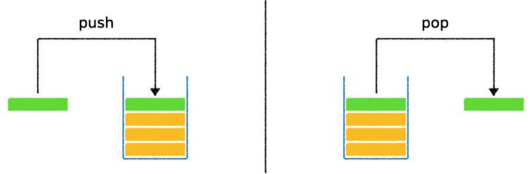
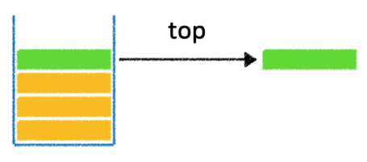
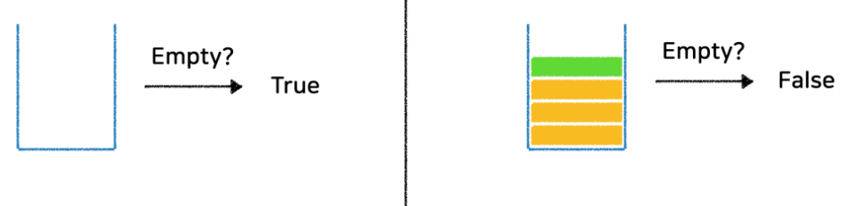
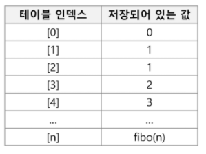
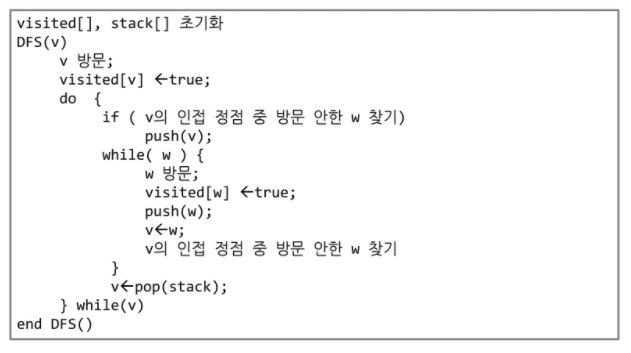

# 스택1

### 스택

* 데이터의 삽입과 삭제가 데이터의 한쪽 끝에서만 일어나는 자료구조
* 가장 마지막에 삽입된 데이터가 가장 먼저 사용되거나 삭제
* 후입선출 ( LIFO - Last In, First Out )

#### push, pop



push : 데이터 삽입

pop : 가장 마지막에 삽입한 데이터를 삭제

​			**스택에 데이터가 비어있는지 여부를 먼저 확인한 후에 실행**

```python
def push(item):
    s.append(item)
    
def pop():
    if len(s) == 0:
        # underflow
        return
    else:
        return s.pop(-1)
```




top : 가장 마지막에 삽입한 데이터를 삭제하지않고 return 해주는 메소드



isEmpty : 현재 스택이 비어있는지 여부를 확인하는 메소드

### 재귀호출

> 자기 자신을 호출하여 순환 수행되는 것
>
> 함수에서 실행해야 하는 작업의 특성에 따라 일반적인 호출방식보다 재귀호출방식을 사용하여 함수를 만들면 프로그램의 크기를 줄이고 간단하게 작성

* 피보나치 수를 구하는 재귀함수

```python
def fibo(n):
    if n == 1:
        return 1
    elif n == 2:
        return 1
    else:
        return fibo(n-1) + fibo(n-2)

# 메모이제이션 기법 사용 X
```

### Memoization

> 동일한 연산을 반복해야 할 때 이전에 연산한 값을 메모리에 미리 저장해 둠으로써 계산의 반복수행을 제거하여 프로그램 실행 속도를 향상시키는 기술

```python
def fibo(n):
    arr = [0,1]  # 배열에 피보나치 수열 값을 순서대로 저장
    for i in range(2, n+1): # n번째에 도달할 때까지 연산
        arr.append(arr[i-1] + arr[i-2]) # i번째 수열을 계산하여 배열에 삽입
    return arr[n]
```

### DP(Dynamic Programming)

> 동적 계획 알고리즘은 그리디 알고리즘과 같이 **최적화 문제**를 해결하는 알고리즘이다.
>
> 입력 크기가 작은 부분 문제들을 모두 해결한 후에 그 해들을 이용하여 보다 큰 크기의 부분 문제들을 해결하여, 최종적으로 원래 주어진 입력의 문제를 해결하는 알고리즘이다.

1. 문제를 부분 문제로 분할한다.
2. 가장 작은 부분 문제부터 해를 구한다.
3. 결과를 테이블에 저장하고, 테이블에 저장된 부분 문제의 해를 이용하여 상위 문제의 해를 구한다.



```python
def fibo(n):
    f = [0, 1]
    for i in range(2, n+1):
        f.append(f[i-1] + f[i-2])
    return f[n]
```

### DFS

> 시작 정점의 한 방향으로 갈 수 있는 경로가 있는 곳까지 깊이 탐색해 가다가 더 이상 갈 곳이 없게 되면, 가장 마지막에 만났던 갈림길 간선이 있는 정점으로 되돌아와서 다른 방향의 정점으로 탐색을 계속 반복하여 결국 모든 정점을 방문하는 순회방법

* 깊이 우선 탐색(Depth First Search, DFS)
* 너비 우선 탐색(Breadth First Search, BFS)

**DFS 알고리즘**

1. 시작 정점 v를 결정하여 방문한다.
2. 정점 v에 인접한 정점 중에서
   1. 방문하지 않은 정점 w가 있으면, 정점 v를 스택에 push하고 정점 w를 방문한다. 그리고 w를 v로 하여 다시 2.를 반복한다.
   2. 방문하지 않은 정점이 없으면, 탐색의 방향을 바꾸기 위해서 스택을 pop하여 받은 가장 마지막 방문 정점을 v로 하여 다시 2.를 반복한다.
3. 스택이 공백이 될 때까지 2.를 반복한다.



```python
def dfs(v):
    st = []
    st.append(v)
    visited[v] = True
    while st:
        v = st.pop()
        print(v, end=' ')
        for w in G[v]:
            if not visited[w]:
                st.append(w)
                visited[w] = True
            
G = [[], [2, 3], [1, 4, 5], [1, 7], [2, 6], [2, 6], [4, 5, 7], [3, 6]]
visited = [0] * 8

dfs(1)
```


