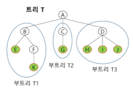
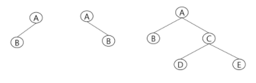
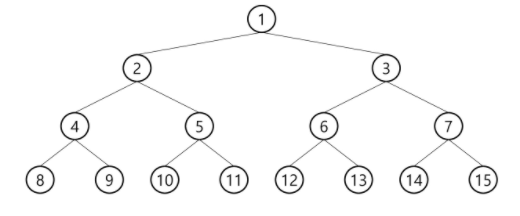
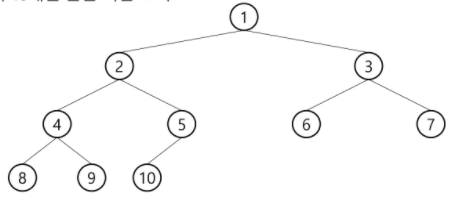
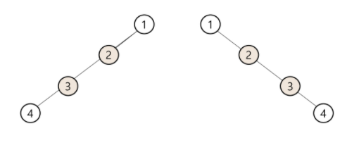

# 트리

### 트리

> 비선형 구조
>
> 원소들 간에 1:n 관계를 가지는 자료구조
>
> 원소들 간에 계층관계를 가지는 계층형 자료구조
>
> 상위 원소에서 하위 원소로 내려가면서 확장되는 트리모양의 구조

* 한 개 이상의 노드로 이루어진 유한 집합이며 다음 조건을 만족
  * 노드 중 최상위 노드를 루트(root)라 한다.
  * 나머지 노드들은 n(>=0)개의 분리집합 T1,...,TN으로 분리될 수 있다.
* 이들 T1,...,TN은 각각 하나의 트리가 되며(재귀적 정의) 루트의 부 트리 (subtree)라 한다.

**용어정리**

* 노드(node) - 트리의 원소 (A,BC,D,E,F,G,H,I,J,K)
* 간선(edge) - 노드를 연결하는 선, 부모 노드와 자식 노드를 연결
* 루트 노드(root node) - 트리의 시작 노드 (A)
* 형제 노드(sibling node) - 같은 부모 노드의 자식 노드들 (B,C,D)
* 조상 노드 - 간선을 따라 루트 노드까지 이르는 경로에 있는 모든 노드들 (K:F,B,A)
* 서브 트리(subtree) - 부모 노드와 연결된 간선을 끊었을 때 생성되는 트리
* 자손 노드 - 서브 트리에 있는 하위 레벨의 노드들 (B:E,F,K)
* 차수(degree)
  * 노드의 차수 : 노드에 연결된 자식 노드의 수
  * 트리의 차수 : 트리에 있는 노드의 차수 중에서 가장 큰 값
  * 단말 노드 : 차수가 0인 노드, 자식 노드가 없는 노드
* 높이
  * 노드의 높이 : 루트에서 노드에 이르는 간선의 수. 노드의 레벨
  * 트리의 높이 : 트리에 있는 노드의 높이 중에서 가장 큰 값. 최대 레벨

### 이진 트리

> 모든 노드들이 2개의 서브트리를 갖는 특별한 형태의 트리
>
> 각 노드가 자식 노드를 최대한 2개까지만 가질 수 있는 트리

#### 포화 이진 트리

* 모든 레벨에 노드가 포화상태로 차 있는 이진 트리
* 높이가 h일 때, 최대 노드 개수인 (2^(h+1)-1)의 노드를 가진 이진 트리
* 루트를 1번으로 하여 (2^(h+1)-1)까지 정해진 위치에 대한 노드 번호를 가짐

#### 완전 이진 트리

* 높이가 h이고 노드 수가 n개 일 때, 포화 이진 트리의 노드 번호 1번부터 n번까지 빈 자리가 없는 이진 트리

#### 편향 이진 트리

* 높이 h에 대한 최소 개수의 노드를 가지면서 한쪽 방향의 자식 노드만을 가진 이진 트리

### 이진탐색 트리

### 힙

