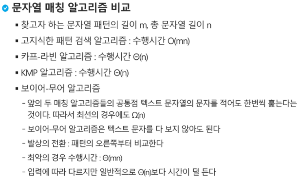

# 문자열(string)

### 문자열

### 패턴 매칭

* 패턴 매칭에 사용되는 알고리즘들

  * 고지식한 패턴 검색 알고리즘 (Brute Force)

    * 처음부터 끝까지 차례대로 순회하면서 패턴 내의 문자들을 일일이 비교하는 방식으로 동작
    * 시간 복잡도 : O(MN)

  * 카프-라빈 알고리즘

  * KMP 알고리즘

    * 불일치가 발생한 텍스트 스트링의 앞 부분에 어떤 문자가 있는지를 미리 알고있으므로, 불일치가 발생한 앞 부분에 대하여 다시 비교하지 않고 매칭을 수행

    * 패턴을 전처리하여 배열 next[M]을 구해서 잘못된 시작을 최소화함

    * 시간 복잡도 : O(M+N)

      ```python
      target = 'ABC'
      text = 'ABABCA'
      
      for i in range(len(text)-len(target)):
          for j in range(len(target)):
              if text[i+j] == target[j]:
                  j += 1
              else:
                  break
          print('Identified')
          break
      ```

  * 보이어-무어 알고리즘

    * 오른쪽에서 왼쪽으로 비교
    * 보이어-무어 알고리즘은 패턴에 오른쪽 끝에 있는 문자가 불일치하고 이 문자가 패턴 내에 존재하지 않는 경우, 이동 거리는 무려 패턴의 길이 만큼이 된다.




