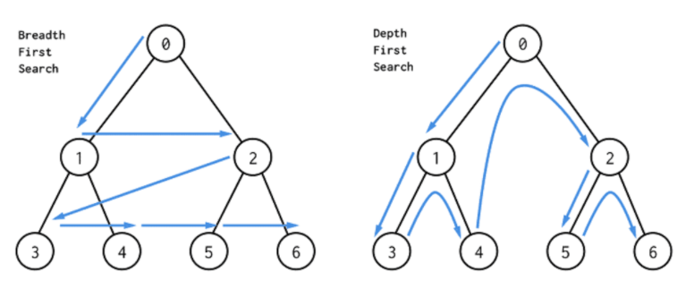

### DFS, BFS 완전정복 하기

#### boj 1260번: DFS와 BFS




#### 문제

그래프를 DFS, BFS로 탐색한 결괄르 출력

단, 방문할 수 있는 정점이 여러 개인 경우에는 정점 번호가 작은 것을 먼저 방문하고, 더 이상 방문할 수 있는 점이 없는 경우 종료

#### 입력

N : 정점의 개수(1<= N <= 1,000)

M : 간선의 개수(1 <= M <= 10,000)

V : 탐색을 시작할 정점의 번호

다음 M개의 줄에 걸쳐 간선이 연결하는 두 정점의 번호가 주어진다.

입력으로 주어지는 간선은 양방향이다.

#### 출력

DFS 방식으로 V 부터 방문된 점을 순서대로 출력

BFS 방식으로 V 부터 방문된 점을 순서대로 출력

```python
N, M, V = map(int, input().split())
matrix = [[0]*(N+1) for _ in range(N+1)]
for i in range(M):
    a, b = map(int, input().split())
    matrix[a][b] = matrix[b][a] = 1
visited = [0] * (N+1)

def dfs(V):
    visited[V] = 1 # 방문한 점 1로 체크
    print(V, end=' ')
    for i in range(1, N+1):
        if visited[i] == 0 and matrix[V][i] == 1:
            dfs(i)

def bfs(V):
    queue = [V] # 들려야 할 정점 저장
    visited[V] = 0 # 방문한 점 0으로 체크
    while queue:
        V = queue.pop(0)
        print(V, end=' ')
        for i in range(1, N+1):
            if visited[i] == 1 and matrix[V][i] == 1:
                queue.append(i)
                visited[i] = 0

dfs(V)
print()
bfs(V)
```

